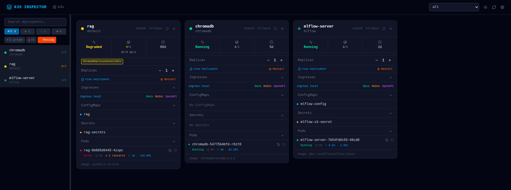
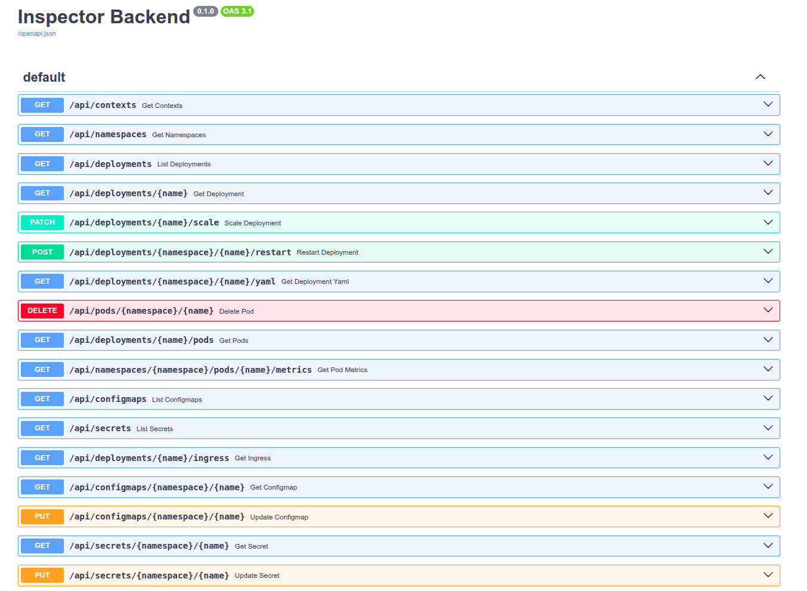

# KExplorer

A real-time, highly-opinionated, web-based Kubernetes dashboard for managing deployments, pods, and cluster resources. Built for K3s and any standard Kubernetes cluster based on my personal workflow and preferences.



## Features

- **Pin deployments** — click any deployment in the sidebar to pin it to the main workspace for focused monitoring
- **Real-time deployment monitoring** — watch pod statuses, replica counts, and conditions update live via WebSocket events
- **Pod lifecycle badges** — visual indicators for `Terminating`, `Pending`, `ContainerCreating`, `CrashLoopBackOff`, `ImagePullBackOff`, `OOMKilled`, `Running`, `Completed`, and `Failed`
- **Deployment conditions** — surface `ReplicaFailure`, `Progressing`, and availability status inline on each card
- **Live event stream** — WebSocket-powered Kubernetes event feed in the sidebar with connection status and auto-refresh
- **Pod log streaming** — open real-time container logs in a dock panel without leaving the page
- **Pod restart** — one-click pod deletion (Kubernetes recreates via ReplicaSet)
- **Scale replicas** — up/down controls directly on each deployment card
- **Ingress viewer** — expand the Ingresses section on any pinned card to see host rules and service paths
- **ConfigMap & Secret editor** — inline YAML editor with syntax highlighting for quick edits
- **Deployment YAML viewer** — inspect full deployment manifests
- **Dark / light mode** — fully themed UI
- **Namespace filter** — switch context across cluster namespaces
- **Group filters** — custom deployment groupings for focused views

## Architecture

| Layer | Tech |
|---|---|
| Frontend | React + TypeScript + Tailwind CSS + Vite |
| Backend | FastAPI (Python) |
| Kubernetes client | Official Python client with watch API |
| Real-time | WebSockets (events + log streaming) |
| Metrics | `metrics.k8s.io` API (when metrics-server is available) |

## Prerequisites

- Python 3.10+
- Node.js 18+
- A Kubernetes cluster with `kubectl` configured (K3s, minikube, EKS, GKE, etc.)
- *(Optional)* `metrics-server` for pod CPU/memory metrics

## Quick Start

### 1. Clone and enter the project

```bash
git clone https://github.com/aymenkrifa/KExplorer.git
cd KExplorer
```

### 2. Backend

```bash
cd backend
uv sync
uv run uvicorn main:app --host 0.0.0.0 --port 3001
```

The backend starts on `http://localhost:3001`.

### 3. Frontend

```bash
cd ../frontend
npm install
npm run dev
```

The frontend starts on `http://localhost:5173` and proxies API/WebSocket calls to the backend.

## Security & scope

KExplorer is designed for **local, single-user development** against a cluster you already have admin access to. It is intentionally not hardened:

- **No authentication.** Anyone who can reach the backend can drive your cluster.
- **CORS is wide open** (`allow_origins=["*"]`).
- **Secrets are decoded server-side** and returned as plaintext to the browser.
- **The backend uses your local kubeconfig** — whatever context is active when the server starts is the cluster it operates on. Switching contexts requires a restart.

Do not expose the backend on a network you don't fully control. Run it on `localhost` only.

## Environment Variables

| Variable | Default | Description |
|---|---|---|
| `KUBECONFIG` | `~/.kube/config` | Path to your kubeconfig file |

## API Endpoints



### REST

| Method | Endpoint | Description |
|---|---|---|
| GET | `/api/contexts` | List kubeconfig contexts |
| GET | `/api/namespaces` | List namespaces |
| GET | `/api/deployments` | List deployments (optionally filtered by names) |
| GET | `/api/deployments/{name}` | Single deployment details |
| GET | `/api/deployments/{name}/pods` | Pods for a deployment |
| GET | `/api/deployments/{name}/yaml` | Deployment manifest as YAML |
| POST | `/api/deployments/{name}/restart` | Rolling restart (patch annotation) |
| POST | `/api/deployments/{name}/scale` | Scale replicas |
| GET | `/api/namespaces/{ns}/pods/{name}/metrics` | Pod CPU/memory (requires metrics-server) |
| DELETE | `/api/pods/{namespace}/{name}` | Delete a pod |
| GET/PUT | `/api/configmaps` | List / update ConfigMaps |
| GET/PUT | `/api/secrets` | List / update Secrets |

### WebSockets

| Path | Description |
|---|---|
| `/ws/logs?namespace=...&pod=...&container=...` | Real-time pod log stream |
| `/ws/events` | Real-time Kubernetes event stream (all namespaces) |

## License

MIT — see [LICENSE](LICENSE).
